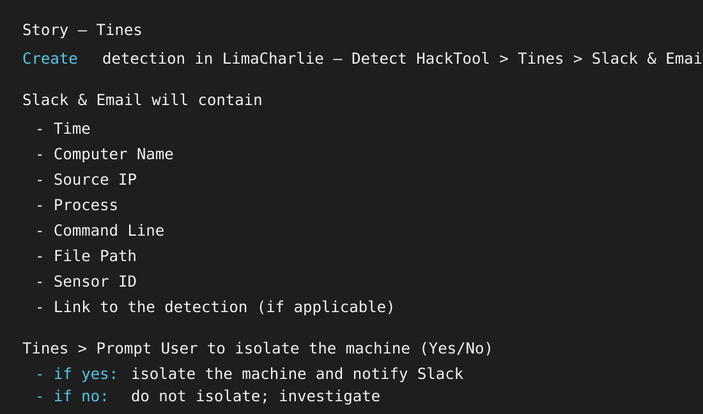
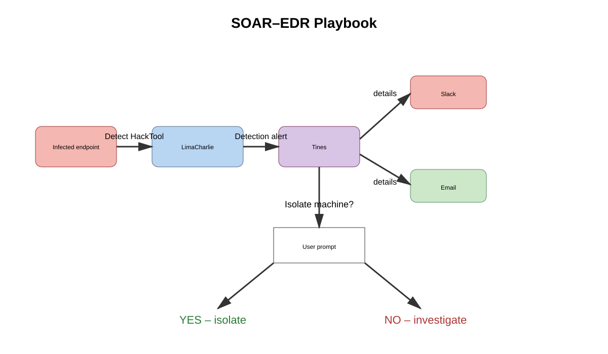
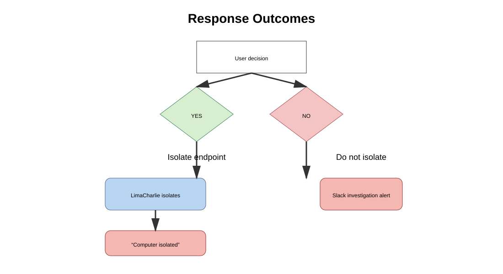
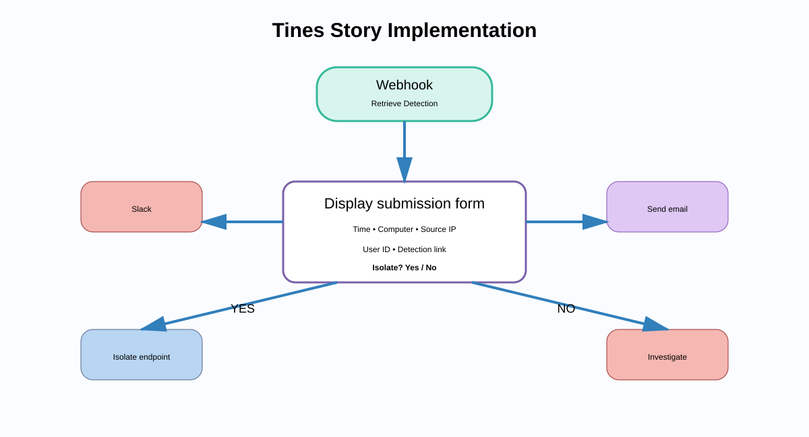

# SOAR–EDR Project Report

## 1. Executive Summary

This project demonstrates a Security Orchestration, Automation, and Response (SOAR) workflow integrated with Endpoint Detection and Response (EDR). The workflow uses LimaCharlie to detect suspicious endpoint activity and Tines to automate notification, user approval, and endpoint-isolation actions.

The specific use case is a **HackTool detection**. When LimaCharlie detects the activity, Tines retrieves the detection, sends the alert details to Slack and email, and presents an isolation decision to an authorized user. If isolation is approved, LimaCharlie isolates the endpoint and posts a confirmation. If isolation is declined, the endpoint remains connected and the security team receives an investigation notification.

## 2. Project Objectives

- Detect suspicious endpoint activity through LimaCharlie.
- Forward detection alerts to Tines for orchestration.
- Include actionable context in each notification.
- Notify responders through Slack and email.
- Obtain approval before taking a disruptive containment action.
- Isolate a potentially compromised computer when approved.
- Notify the security team of the final response status.

## 3. Technologies and Components

| Component | Role |
|---|---|
| LimaCharlie | EDR platform that detects HackTool activity and performs endpoint isolation. |
| Tines | SOAR platform that retrieves detections, sends notifications, and displays the approval form. |
| Slack | Security-team notification and response channel. |
| Email | Secondary alert and escalation channel. |
| Endpoint sensor | Collects endpoint telemetry and identifies the affected computer. |

## 4. Alert Data

The Slack and email notifications are designed to include:

- Detection time
- Computer name
- Source IP address
- Process name
- Command line
- File path
- Sensor ID
- Link to the detection, when available

This context helps analysts validate the alert and make an informed containment decision.

## 5. Incident-Response Workflow

1. A potentially infected endpoint triggers a **Detect HackTool** event.
2. LimaCharlie generates the detection alert.
3. Tines retrieves the detection and extracts the relevant details.
4. Tines sends the details to Slack and email.
5. Tines displays a user prompt asking whether the machine should be isolated.
6. If the response is **Yes**, Tines calls LimaCharlie to isolate the endpoint.
7. Tines sends a Slack confirmation stating that the computer has been isolated.
8. If the response is **No**, the endpoint is not isolated and Slack receives an investigation message.

## 6. Decision Outcomes

### Approved Isolation

LimaCharlie isolates the endpoint. The workflow reports:

> The computer `<computer>` has been isolated.

This limits network access and helps prevent further malicious activity or lateral movement while the incident is investigated.

### Isolation Declined

LimaCharlie does not isolate the endpoint. The workflow reports:

> The computer `<computer>` was not isolated, please investigate.

The security team must then perform manual investigation and determine the next action.

## 7. Tines Story Implementation

The Tines implementation contains three key stages:

- **Webhook – Retrieve Detection:** receives or retrieves the detection event.
- **Display Submission Form:** presents detection details and the Isolate? Yes/No decision.
- **Notification actions:** sends alert information and response status to Slack and email.

The workflow is enabled and uses a Slack credential for the notification action shown in the implementation screenshot.

## 8. Security and Operational Considerations

- Isolation is a disruptive action and should be limited to authorized responders.
- Detection details should be validated before containment.
- Critical servers should have an additional approval or exception process.
- Slack and email messages should avoid exposing unnecessary sensitive data.
- All decisions and isolation results should be logged for auditing.
- Playbooks should be tested with both the Yes and No paths.
- False positives should be reviewed and detection rules tuned regularly.

## 9. Testing Plan

The playbook should be validated using controlled test events:

1. Generate a benign HackTool test detection.
2. Confirm that Tines receives the event.
3. Verify that Slack and email contain all required fields.
4. Test the **Yes** response and confirm LimaCharlie isolates the endpoint.
5. Test the **No** response and confirm that no isolation occurs.
6. Verify the corresponding Slack messages.
7. Confirm that timestamps, computer names, and detection links are correct.
8. Review execution logs and confirm that failed actions are visible to responders.

## 10. Benefits

- Faster alert distribution and response coordination.
- Reduced repetitive work for security analysts.
- Consistent handling of similar endpoint detections.
- Human approval before endpoint isolation.
- Clear communication through multiple channels.
- Better incident documentation and auditability.

## 11. Recommendations

- Add automatic enrichment using threat-intelligence services.
- Add an incident-ticket creation step.
- Add an approval timeout and escalation path.
- Add an explicit recovery workflow to release an isolated endpoint after remediation.
- Integrate asset criticality and user information into the prompt.
- Add monitoring for failed webhook, Slack, email, and isolation actions.
- Expand the playbook to cover ransomware, suspicious PowerShell, and credential-theft detections.

## 12. Conclusion

The SOAR–EDR project provides a practical endpoint-incident workflow that combines LimaCharlie detection and response with Tines orchestration. It gives responders the information needed to assess a HackTool alert, supports a controlled isolation decision, and communicates the result to the security team. The design provides a strong foundation for additional automation, enrichment, and incident-response playbooks.

## 13. Project Images

The following diagrams document the playbook requirements, architecture, response branches, and Tines implementation. The diagrams are included as editable SVG illustrations based on the supplied project screenshots.

### Figure 1 — Playbook Requirements

### Figure 2 — SOAR–EDR Architecture and Decision Flow

### Figure 3 — Isolation and Investigation Outcomes

### Figure 4 — Tines Story Implementation

